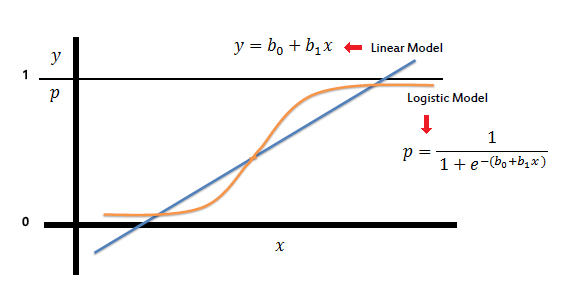
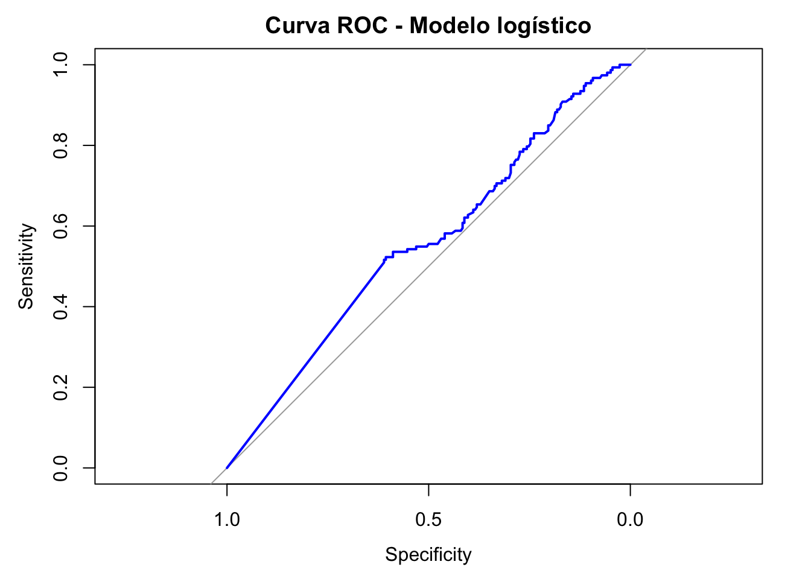

2025-05-16

::: {style="text-align: center;"}
<p>*Zamora, T. Jesús D*\[\^a\]. [info.thowinsson\@gmail.com](mailto:info.thowinsson@gmail.com){.email}</p>

<p>Barranquilla-Colombia.</p>
:::

```{=html}
<style>
  #TOC::before {
    content: "";
    display: block;
    width: 100%;
    background-image: url('Imagen_portada.png');
    background-size: cover;
    background-repeat: no-repeat;
    background-position: center;
    margin-bottom: 20px;
    border-radius: 10px;
    height: 350px; /* Ajusta la altura según tu imagen */
  }
</style>
```

::: {#toc-imagen-container}

:::


# Cargar Datos

## Paso 1: Carga de los datos y exploración inicial


::: {.cell layout-align="center"}

```{.r .cell-code}
# Cargar paquete necesario
library(lsm)

# Cargar datos
datos <- pros
attach(datos)

# Visualizar estructura de los datos
str(datos)
```

::: {.cell-output .cell-output-stdout}

```
tibble [380 × 9] (S3: tbl_df/tbl/data.frame)
 $ ID     : num [1:380] 1 2 3 4 5 6 7 8 9 10 ...
 $ CAPSULE: num [1:380] 0 0 0 0 0 1 0 0 0 0 ...
 $ AGE    : num [1:380] 65 72 70 76 69 71 68 61 69 68 ...
 $ RACE   : num [1:380] 1 1 1 2 1 1 2 2 1 2 ...
 $ DPROS  : num [1:380] 2 3 1 2 1 3 4 4 1 1 ...
 $ DCAPS  : num [1:380] 1 2 2 1 1 2 2 2 1 2 ...
 $ PSA    : num [1:380] 1.4 6.7 4.9 51.2 12.3 3.3 31.9 66.7 3.9 13 ...
 $ VOL    : num [1:380] 0 0 0 20 55.9 0 0 27.2 24 0 ...
 $ GLEASON: num [1:380] 6 7 6 7 6 8 7 7 7 6 ...
```


:::
:::


### Explicación:

-   Primero cargamos los datos del paquete lsm y usamos attach() para acceder directamente a las variables.

-   La función str() nos muestra la estructura de los datos: tipos de variables, dimensiones y primeras observaciones.

-   Esto nos permite verificar que $CAPSULE$ sea binaria (0/1) y $VOL$ sea numérica.

## Paso 2: Examinar las variables de interés


::: {.cell layout-align="center"}

```{.r .cell-code}
# Resumen estadístico
summary(CAPSULE)
```

::: {.cell-output .cell-output-stdout}

```
   Min. 1st Qu.  Median    Mean 3rd Qu.    Max. 
 0.0000  0.0000  0.0000  0.4026  1.0000  1.0000 
```


:::

```{.r .cell-code}
summary(VOL)
```

::: {.cell-output .cell-output-stdout}

```
   Min. 1st Qu.  Median    Mean 3rd Qu.    Max.    NA's 
   0.00    0.00   14.30   15.85   26.50   97.60       1 
```


:::

```{.r .cell-code}
# Tabla de frecuencia para CAPSULE
table(CAPSULE)
```

::: {.cell-output .cell-output-stdout}

```
CAPSULE
  0   1 
227 153 
```


:::
:::


### Explicación

-   Examinamos las estadísticas descriptivas de nuestras variables.

-   Para CAPSULE (variable dependiente), verificamos la distribución de 0s y 1s para ver si hay desbalance.

-   Para VOL (variable independiente), observamos su rango, media y distribución.

-   Esto nos ayuda a entender los datos antes de modelarlos.

## Paso 3: Ajustar el modelo de regresión logística


::: {.cell layout-align="center"}

```{.r .cell-code}
## Ajustar modelo de regresión logística
modelo <- glm(CAPSULE ~ VOL, family = binomial(link = "logit"), data = datos)

# Resumen del modelo
summary(modelo)
```

::: {.cell-output .cell-output-stdout}

```

Call:
glm(formula = CAPSULE ~ VOL, family = binomial(link = "logit"), 
    data = datos)

Coefficients:
             Estimate Std. Error z value Pr(>|z|)  
(Intercept) -0.178542   0.138541  -1.289   0.1975  
VOL         -0.013817   0.006116  -2.259   0.0239 *
---
Signif. codes:  0 '***' 0.001 '**' 0.01 '*' 0.05 '.' 0.1 ' ' 1

(Dispersion parameter for binomial family taken to be 1)

    Null deviance: 511.26  on 378  degrees of freedom
Residual deviance: 505.86  on 377  degrees of freedom
  (1 observation deleted due to missingness)
AIC: 509.86

Number of Fisher Scoring iterations: 4
```


:::
:::


### Explicación

-   Usamos la función *glm()* para ajustar el modelo logístico, que es apropiado cuando nuestra variable dependiente es binaria.

-   Especificamos *family = binomial(link = "logit")* para indicar que es una regresión logística.

-   El resumen del modelo muestra:

    -   Coeficientes estimados (intercepto y pendiente para VOL)

    -   Error estándar de los coeficientes

    -   Estadístico z y valor p para evaluar significancia

    -   Devianza nula y residual para evaluar el ajuste global

    -   AIC (Criterio de Información de Akaike)

## Paso 4: Interpretar los coeficientes y odds ratios


::: {.cell layout-align="center"}

```{.r .cell-code}
# Odds ratios con intervalos de confianza
exp(coef(modelo))
```

::: {.cell-output .cell-output-stdout}

```
(Intercept)         VOL 
  0.8364889   0.9862779 
```


:::

```{.r .cell-code}
exp(cbind(OR = coef(modelo), confint(modelo)))
```

::: {.cell-output .cell-output-stdout}

```
                   OR     2.5 %    97.5 %
(Intercept) 0.8364889 0.6370444 1.0973512
VOL         0.9862779 0.9741764 0.9978833
```


:::
:::


### Explicación

-   En regresión logística, los coeficientes están en escala logarítmica, por lo que aplicamos la función exponencial para obtener los odds ratios.
-   El odds ratio para VOL indica cuánto cambian las probabilidades de CAPSULE=1 por cada unidad de aumento en VOL.
-   Si OR \> 1: aumenta la probabilidad de CAPSULE=1 cuando aumenta VOL.
-   Si OR \< 1: disminuye la probabilidad de CAPSULE=1 cuando aumenta VOL.
-   Los intervalos de confianza nos indican la precisión de la estimación.

## Paso 5: Evaluar la bondad de ajuste del modelo


::: {.cell layout-align="center"}

```{.r .cell-code}
# Instalar y cargar ResourceSelection si no está instalado
if (!require("ResourceSelection")) {
  install.packages("ResourceSelection")
  library(ResourceSelection)
} else {
  library(ResourceSelection)
}

# Este código:
# - Se asegura de que no haya errores de longitud.
# - Ejecuta el test de Hosmer-Lemeshow correctamente.
# - Muestra los valores clave de manera clara.

# Eliminar casos con NA en las variables relevantes
datos_completos <- na.omit(datos[, c("CAPSULE", "VOL")])

# Ajustar el modelo con los datos completos
modelo <- glm(CAPSULE ~ VOL, family = binomial, data = datos_completos)

# Test de Hosmer-Lemeshow (g=10 grupos predichos)
hoslem <- hoslem.test(datos_completos$CAPSULE, fitted(modelo), g = 10)
print(hoslem)
```

::: {.cell-output .cell-output-stdout}

```

	Hosmer and Lemeshow goodness of fit (GOF) test

data:  datos_completos$CAPSULE, fitted(modelo)
X-squared = 5.8677, df = 4, p-value = 0.2092
```


:::

```{.r .cell-code}
# Devianza, grados de libertad y p-valor
devianza <- with(modelo, null.deviance - deviance)
gl <- with(modelo, df.null - df.residual)
pvalor <- with(modelo, pchisq(devianza, gl, lower.tail = FALSE))

# Mostrar resultados con nombres
cat("\nEstadístico Chi-cuadrado:", round(devianza, 4),
    "\nGrados de libertad:", gl,
    "\nValor-p:", round(pvalor, 4), "\n")
```

::: {.cell-output .cell-output-stdout}

```

Estadístico Chi-cuadrado: 5.399 
Grados de libertad: 1 
Valor-p: 0.0201 
```


:::
:::


### Explicación

-   El test de Hosmer-Lemeshow evalúa si las probabilidades predichas concuerdan con las observadas.
-   Un valor p \> 0.05 sugiere un buen ajuste (no hay diferencias significativas entre valores observados y predichos).
-   La diferencia de devianza (null.deviance - deviance) sigue una distribución Chi-cuadrado.
-   El valor p asociado a esta diferencia nos indica si nuestro modelo es significativamente mejor que un modelo nulo (sin predictores).

## Paso 6: Analizar la capacidad predictiva del modelo


::: {.cell layout-align="center"}

```{.r .cell-code}
# Instalar y cargar ResourceSelection si no está instalado
if (!require("pROC")) {
  install.packages("pROC")
  library(pROC)
} else {
  library(pROC)
}

# Filtrar los datos sin valores perdidos en las variables del modelo
datos_completos <- na.omit(datos[, c("CAPSULE", "VOL")])

# Ajustar el modelo logístico con los datos completos
modelo <- glm(CAPSULE ~ VOL, family = binomial, data = datos_completos)

# Obtener probabilidades predichas
prob_pred <- predict(modelo, type = "response")

# Calcular la curva ROC usando CAPSULE y las probabilidades predichas
curva_roc <- roc(datos_completos$CAPSULE, prob_pred)

# Graficar la curva ROC
plot(curva_roc, main = "Curva ROC - Modelo logístico", col = "blue")
```

::: {.cell-output-display}
{fig-align='center' width=672}
:::

```{.r .cell-code}
# Calcular y mostrar el AUC (área bajo la curva)
auc(curva_roc)
```

::: {.cell-output .cell-output-stdout}

```
Area under the curve: 0.5543
```


:::
:::


## Paso 7: Clasificación y evaluación del rendimiento


::: {.cell layout-align="center"}

```{.r .cell-code}
# Instalar y cargar paquetes necesarios
paquetes_necesarios <- c("knitr")
for (p in paquetes_necesarios) {
  if (!require(p, character.only = TRUE)) {
    install.packages(p)
    library(p, character.only = TRUE)
  } else {
    library(p, character.only = TRUE)
  }
}

# Asegurar que se usen los datos completos
datos_completos <- na.omit(datos[, c("CAPSULE", "VOL")])

# Ajustar modelo de regresión logística
modelo <- glm(CAPSULE ~ VOL, family = binomial, data = datos_completos)

# Obtener probabilidades predichas
prob_pred <- predict(modelo, type = "response")

# Clasificación con umbral de 0.5
pred_class <- ifelse(prob_pred > 0.5, 1, 0)

# Convertir a factores con niveles definidos
real <- factor(datos_completos$CAPSULE, levels = c(0, 1))
pred <- factor(pred_class, levels = c(0, 1))

# Tabla de clasificación
tabla <- table(Real = real, Predicho = pred)
tabla_df <- as.data.frame.matrix(tabla)

# Mostrar tabla con formato
knitr::kable(tabla_df, caption = "Matriz de Confusión", align = "c")
```

::: {.cell-output-display}


Table: Matriz de Confusión

|   |  0  | 1 |
|:--|:---:|:-:|
|0  | 226 | 0 |
|1  | 153 | 0 |


:::

```{.r .cell-code}
# Calcular métricas
accuracy <- sum(diag(tabla)) / sum(tabla)
sensitivity <- if (tabla[2,2] + tabla[2,1] > 0) tabla[2,2] / sum(tabla[2,]) else NA
specificity <- if (tabla[1,1] + tabla[1,2] > 0) tabla[1,1] / sum(tabla[1,]) else NA

# Crear tabla de métricas
metricas <- data.frame(
  Métrica = c("Exactitud (Accuracy)", "Sensibilidad (Recall)", "Especificidad"),
  Valor = c(round(accuracy, 3), round(sensitivity, 3), round(specificity, 3))
)

# Mostrar métricas
knitr::kable(metricas, caption = "Métricas del Modelo", align = "c")
```

::: {.cell-output-display}


Table: Métricas del Modelo

|        Métrica        | Valor |
|:---------------------:|:-----:|
| Exactitud (Accuracy)  | 0.596 |
| Sensibilidad (Recall) | 0.000 |
|     Especificidad     | 1.000 |


:::
:::


## Paso 8: Visualización gráfica del modelo


::: {.cell layout-align="center"}

```{.r .cell-code}
# Gráfico de la regresión logística
library(ggplot2)
ggplot(datos, aes(x = VOL, y = CAPSULE)) +
  geom_point(alpha = 0.5) +
  stat_smooth(method = "glm", method.args = list(family = binomial)) +
  labs(title = "Regresión logística: CAPSULE ~ VOL",
       x = "Volumen (VOL)",
       y = "Probabilidad de CAPSULE = 1") +
  theme_minimal()
```

::: {.cell-output-display}
{fig-align='center' width=672}
:::
:::


### Explicación

-   Este gráfico muestra la relación entre VOL y la probabilidad de CAPSULE=1.
-   Los puntos representan los datos observados (0 y 1).
-   La curva azul es la función logística ajustada, mostrando cómo cambia la probabilidad predicha de CAPSULE=1 a medida que aumenta VOL.
-   La zona sombreada representa el intervalo de confianza del 95%.
-   Este gráfico nos permite visualizar fácilmente si existe una relación positiva o negativa entre VOL y la probabilidad de CAPSULE=1.